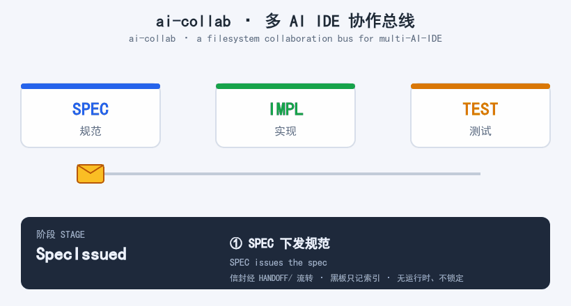

# AI-COLLAB 使用说明  *(AI-COLLAB Usage Guide)*

> ai-collab platform version: v1.1 | 最后更新：2026-07-07
> ai-collab platform version: v1.1 | Last updated: 2026-07-07

`AI-COLLAB` 是一个面向多 AI IDE 协作的文件系统协作总线。它用一组 Markdown / JSON 文件模拟轻量级的 `CCP/CBB` 机制，让不同的 AI IDE 可以在同一套协议下完成任务分发、认领、实现、测试、验收、审计和恢复。

`AI-COLLAB` is a filesystem-based collaboration bus for multi-AI-IDE cooperation. It uses a set of Markdown / JSON files to emulate a lightweight `CCP/CBB` (Collaboration Control Plane / Collaboration Blackboard) mechanism, letting different AI IDEs distribute, claim, implement, test, accept, audit, and recover tasks under one shared protocol.

> 一句话理解：它不是一个自动化平台，而是一套让多个人类/AI IDE"按同一套规矩交接工作"的协作协议与目录结构。
> *In one line: it is not an automation platform, but a collaboration protocol and directory structure that lets multiple humans / AI IDEs "hand off work by the same rules".*

> 👉 第一次使用？请先读 [操作手册 QUICKSTART.md](QUICKSTART.md)。
> *👉 First time? Read the [Operation Manual / QUICKSTART.md](QUICKSTART.md) first.*

## 演示：一次完整协作循环  *(Demo: one full collaboration cycle)*


*SPEC 下发规范 → IMPL 实现并自测 → TEST 独立初验 → SPEC 验收（无限循环）*
*SPEC issues spec → IMPL implements & self-checks → TEST first-verifies → SPEC accepts (looping)*

> 💡 本仓库根目录随附一份 `SKILL.md`（[SKILL.md](SKILL.md)）——这是一份可直接交给 AI IDE 执行的接入合同，涵盖角色、交接规则与红线；也提供可复制提示词 [PROMPTS.md](PROMPTS.md) 与完整样例 [EXAMPLE.md](EXAMPLE.md)。
> *💡 This repo ships a `SKILL.md` at its root ([SKILL.md](SKILL.md)) — a ready-to-run onboarding contract for your AI IDE, covering roles, handoff rules, and red lines. Copy-paste prompts in [PROMPTS.md](PROMPTS.md) and a full example in [EXAMPLE.md](EXAMPLE.md) are also provided.*

---

## 1. 它是什么，不是什么  *(What it is, and is not)*

### 1.1 它是什么  *(What it is)*

- 一个**文件系统协作总线**：根目录保存协议和模板，具体项目操作写入 `PROJECTS/{project_id}/`。
- A **filesystem collaboration bus**: the root holds protocols and templates; concrete project operations go under `PROJECTS/{project_id}/`.
- 一个**多角色协作协议**：把规范、实现、测试、验收拆成不同角色。
- A **multi-role collaboration protocol**: it splits spec / implementation / test / acceptance into distinct roles.
- 一个**可审计交付机制**：通过 `PROJECTS/{project_id}/HANDOFF/`、`CLAIMS/`、`EVIDENCE/`、`AUDIT/` 追踪每次交付。
- An **auditable delivery mechanism**: every handoff is traced via `PROJECTS/{project_id}/HANDOFF/`, `CLAIMS/`, `EVIDENCE/`, `AUDIT/`.
- 一个**定时器友好的工作流**：支持 AI IDE 定期扫描、续租、交付、同步。
- A **timer-friendly workflow**: AI IDEs can periodically scan, renew leases, deliver, and sync.
- 一个**无定时器可降级机制**：即使 AI IDE 不能自己定时唤醒，也能用人工唤醒、批处理、外部调度器接入。
- A **degradable workflow without timers**: even if an AI IDE cannot wake itself on a schedule, it can still join via manual wake-up, batch mode, or an external scheduler.
- 一个**多项目空间协调机制**：通过 `PROJECTS/{project_id}/` 让 AI IDE 明确自己正在为哪个实际工作目录协作。
- A **multi-project space coordination mechanism**: `PROJECTS/{project_id}/` tells each AI IDE which real working directory it is collaborating on.

### 1.2 它不是什么  *(What it is NOT)*

- 不依赖任何单一 AI IDE 的内部运行时，也不依赖任何专有架构。
- It depends on no single AI IDE's internal runtime, and on no proprietary architecture.
- 不是硬实时任务调度器，不能保证某个 AI IDE 一定会在某个时间执行。
- It is not a hard real-time scheduler and cannot guarantee any AI IDE will act at a specific time.
- 不是权限沙箱，不能替代操作系统权限、Git 权限、CI 权限或人工审批。
- It is not a permission sandbox and cannot replace OS / Git / CI permissions or human approval.
- 不是自动验收系统，`WATCHDOG`、定时器、实现方自检都不能直接代表最终验收。
- It is not an auto-acceptance system; `WATCHDOG`, timers, and self-checks never represent final acceptance.
- 不是秘密管理系统，任何密钥、Token、Cookie、真实隐私数据都不应写入该目录。
- It is not a secret manager; no keys, tokens, cookies, or real PII should ever be written into this directory.

---

## 核心目标与设计理念  *(Core purpose and design philosophy)*

ai-collab 的核心目标，是在一个真实开发项目中实现「规范—计划—代码—测试—佐证」五类产出的端到端对齐：以规范锚定正确方向，以计划拆解执行路径，以代码完成落地实现，以测试独立验证，以佐证形成可审计留痕，从而确保交付物具备较高质量并对结果负责。CONSULTANT（顾问）与 QA 两个角色贯穿项目始终，持续监控实现过程、管理合规与质量，对过程负责。

The core purpose of ai-collab is to achieve end-to-end alignment of five classes of deliverables — specification, plan, code, test, and evidence — within a real development project: the specification anchors the correct direction, the plan decomposes the execution path, the code realizes the implementation, the test independently verifies it, and the evidence produces an auditable trail. This ensures deliverables attain high quality and are accountable for outcomes. The CONSULTANT and QA roles run across the entire project lifecycle, continuously monitoring the implementation process and governing compliance and quality — they are accountable for the process.

---

## 适用场景、适用人群与价值  *(When to use, who it is for, and the value)*

### 谁适合用  *(Who it is for)*
- 同时装了 **两个及以上 AI IDE**，却苦于它们之间无法协作、只能人工搬运上下文的开发者。
- Developers running **two or more AI IDEs** who struggle to make them cooperate and resort to manually carrying context between them.
- 希望保持 **AI IDE 中立、不被任何一家厂商锁定** 的策略型用户与团队。
- Strategically-minded users and teams who want to stay **AI-IDE-neutral and avoid lock-in** to any single vendor.
- 需要把"规范—计划—代码—测试—佐证"串成可追溯交付、对结果和过程都负责的协作场景。
- Teams that need to chain specification → plan → code → test → evidence into a traceable delivery accountable for both outcomes and process.

### 在哪能用  *(Where it fits)*
- 多 AI IDE 共同推进同一个真实开发项目（每个项目空间对应一个实际工作目录）。
- Multiple AI IDEs advancing one real development project (each project space maps to one real working directory).
- 跨厂商、跨会话的协作：不同 AI IDE 各自保留，只共享一个目录，按同一套 Markdown 契约交接任务。
- Cross-vendor, cross-session cooperation: each AI IDE keeps its own tooling and only shares one directory, handing off tasks by the same Markdown contract.
- 没有中央运行时、不接管任何 AI IDE 的环境——纯协议、靠自觉。
- Environments with no central runtime and no takeover of any AI IDE — pure protocol, honored by convention.

### 带来什么价值  *(What value it brings)*
- **对齐**：五类产出端到端对齐，避免"规范一套、代码另一套、测试又一套"的脱节。
- **Alignment**: the five deliverable classes are aligned end-to-end, avoiding the disconnect where spec, code, and test each go their own way.
- **可审计**：每次交付、认领、佐证、审计都落在文件里，出问题能回溯到责任角色与阶段。
- **Auditability**: every handoff, claim, evidence, and audit is on record, so failures trace back to the responsible role and stage.
- **过程负责**：CONSULTANT 与 QA 贯穿始终，监控实现过程与质量门槛，不让"自觉"变成"裸奔"。
- **Process accountability**: CONSULTANT and QA run throughout, monitoring the implementation process and quality gates, so "by convention" is not "ungoverned".
- **零绑定**：你随时可以加一个 AI IDE、撤一个 AI IDE，协议不变、目录不变。
- **Zero lock-in**: add or drop an AI IDE at any time — the protocol and directory stay the same.

---

## 2. 核心目录速览  *(Core directory overview)*

| 路径 | 用途 | 关键规则 |
|---|---|---|
| `QUICKSTART.md` | 新手操作手册：5 分钟接入与一次完整协作 | 第一次使用先读 |
| `PROMPTS.md` | 可复制即用的各 AI IDE 接入提示词（总合同 + 分角色） | 给每个 AI IDE 发一段 |
| `EXAMPLE.md` | 一次完整 SPEC→IMPL→TEST→Accept 周期的真实产物 | 想照抄样例时读 |
| `CONTRIBUTING.md` | 参与共建指南与双语约定 | 想贡献先读 |
| `PROTOCOL.md` | 总协议，定义角色、信封、状态、审计、禁止行为 | 接入前必须先读 |
| `ACTIONS.md` | 标准动作清单，类似 CBB 动作库 | 执行动作前先检查角色权限 |
| `STRUCTURE.md` | 目录结构边界 | 根目录管协议，项目子目录管操作 |
| `PROJECTS/` | 多项目空间、项目登记、actor 登记 | **项目操作主入口** |
| `PROJECTS/INDEX.md` | 项目索引 | 查找当前已登记项目 |
| `PROJECTS/{project_id}/BLACKBOARD.md` | 项目状态快照和追加式历史 | 项目黑板必须更新；最新条目必须置顶，只写索引和短摘要 |
| `PROJECTS/{project_id}/HANDOFF/` | 项目交付信封队列 | 项目内消息必须写这里 |
| `PROJECTS/{project_id}/CLAIMS/` | 项目任务认领和租约记录 | 长任务必须先有有效 ClaimLease |
| `PROJECTS/{project_id}/HEARTBEAT/` | 项目 actor 存活状态 | 心跳只证明最近活动，不证明任务成功 |
| `PROJECTS/{project_id}/EVIDENCE/` | 项目共享佐证索引 | Runtime / Benchmark / RealProvider 证据必须可复核 |
| `PROJECTS/{project_id}/AUDIT/` | 项目高风险操作和异常审计 | 高风险决策必须写审计 |
| `HANDOFF/`、`CLAIMS/`、`HEARTBEAT/`、`EVIDENCE/`、`AUDIT/` | 根级占位目录 | 不承接具体项目情况；如出现项目文件应迁移到项目子目录 |
| `RUNBOOKS/` | SPEC / IMPL / TEST 角色手册 | AI IDE 按自身角色读取对应手册 |
| `TEMPLATES/` | 标准信封、认领、审计模板 | 新建文件优先从模板复制 |
| `TIMER_LOOP.md` | 定时扫描、续租、心跳、降级规则 | 有定时器的 AI IDE 按此循环执行 |
| `ORDERING.md` | 读写顺序、依赖、revision 控制 | 防止乱序处理和旧状态覆盖 |
| `WATCHDOG.md` | 冲突、过期、缺证据、缺审计检查 | WATCHDOG 只能检查，不能验收/实现/测试 |
| `MONITOR/` | 只读浏览器看板 + 采集脚本 | 默认只读，不替代验收；双击 index.html 即可查看 |
| `LINT.md` | 目录结构校验规则 | 守底线：引用完整性、秘密扫描、根目录边界 |
| `SCHEMAS/` | JSON Schema 定义 | 跨模块数据结构必须在此定义 |
| `ATOMIC_WRITE.md` | 原子写入约定 | 多 AI IDE 并发写文件时保证完整性 |
| `ROOT_MIGRATION.md` | 根目录文件迁移策略 | WATCHDOG 只报告不迁移 |
| `MEMORY_POLICY.md` | 记忆层级与衰减规则 | 4层记忆：Working/Episodic/Semantic/Procedural |
| `PROJECTS/{project_id}/MEMORY/` | 项目级分层记忆 | Working 按 actor 隔离，Episodic 按日期归档 |
| `PROJECTS/{project_id}/BLACKBOARD_ARCHIVE/` | 黑板归档 | 过期黑板状态归档，主黑板保持精简 |
| `PROJECTS/{project_id}/ACTOR_PROFILES/` | Actor 画像与路由建议 | SPEC 委派任务时参考 |
| `PROJECTS/{project_id}/MONITOR/` | 项目级状态数据 | collect.ps1 采集输出，看板读取 |

| Path | Purpose | Key rule |
|---|---|---|
| `QUICKSTART.md` | Operation manual: 5-min onboarding + one full cycle | Read first if new |
| `PROMPTS.md` | Copy-paste onboarding prompts for each AI IDE (master + per-role) | Send one snippet per AI IDE |
| `EXAMPLE.md` | Real artifacts of one full SPEC→IMPL→TEST→Accept cycle | Read to copy a real sample |
| `CONTRIBUTING.md` | How to contribute + bilingual convention | Read before contributing |
| `PROTOCOL.md` | Master protocol: roles, envelopes, states, audit, prohibited acts | Read before onboarding |
| `ACTIONS.md` | Standard action catalog, like a CBB action library | Check role permission before acting |
| `STRUCTURE.md` | Directory boundary rules | Root owns protocols; project subdirs own operations |
| `PROJECTS/` | Multi-project space, project & actor registry | **Primary entry for project operations** |
| `PROJECTS/INDEX.md` | Project index | Find currently registered projects |
| `PROJECTS/{project_id}/BLACKBOARD.md` | Project status snapshot + append-only history | Must be updated; newest on top; indexes + short summary only |
| `PROJECTS/{project_id}/HANDOFF/` | Project delivery envelope queue | In-project messages must go here |
| `PROJECTS/{project_id}/CLAIMS/` | Task claims and lease records | Long tasks need a valid ClaimLease first |
| `PROJECTS/{project_id}/HEARTBEAT/` | Actor liveness | Heartbeat proves recent activity, not success |
| `PROJECTS/{project_id}/EVIDENCE/` | Shared evidence index | Runtime / Benchmark / RealProvider evidence must be reproducible |
| `PROJECTS/{project_id}/AUDIT/` | High-risk / anomaly audit | High-risk decisions must be audited |
| `HANDOFF/`, `CLAIMS/`, `HEARTBEAT/`, `EVIDENCE/`, `AUDIT/` | Root-level placeholders | Do not hold project cases; migrate stray project files to subdirs |
| `RUNBOOKS/` | SPEC / IMPL / TEST role runbooks | Each AI IDE reads its own role runbook |
| `TEMPLATES/` | Standard envelope / claim / audit templates | Copy from template when creating files |
| `TIMER_LOOP.md` | Scan / renew / heartbeat / degrade rules | Timer-capable AI IDEs follow this loop |
| `ORDERING.md` | Read/write order, dependencies, revision control | Prevent out-of-order and stale overwrites |
| `WATCHDOG.md` | Conflict / expiry / missing-evidence / missing-audit checks | WATCHDOG only checks, never accepts/implements/tests |
| `MONITOR/` | Read-only browser dashboard + collector script | Read-only by default, never replaces acceptance; open index.html |
| `LINT.md` | Directory structure validation rules | Baseline: ref integrity, secret scan, root boundary |
| `SCHEMAS/` | JSON Schema definitions | Cross-module data structures defined here |
| `ATOMIC_WRITE.md` | Atomic write convention | Guarantees integrity under concurrent writes |
| `ROOT_MIGRATION.md` | Root file migration strategy | WATCHDOG reports only, never migrates |
| `MEMORY_POLICY.md` | Memory tiers and decay rules | 4 tiers: Working/Episodic/Semantic/Procedural |
| `PROJECTS/{project_id}/MEMORY/` | Project-level tiered memory | Working isolated per actor; Episodic archived by date |
| `PROJECTS/{project_id}/BLACKBOARD_ARCHIVE/` | Blackboard archive | Archive stale state; keep main board concise |
| `PROJECTS/{project_id}/ACTOR_PROFILES/` | Actor profiles and routing hints | Consulted by SPEC when delegating |
| `PROJECTS/{project_id}/MONITOR/` | Project-level status data | Output of collect.ps1, read by dashboard |

---

## 3. 角色与职责  *(Roles and responsibilities)*

下述角色名均为职责缩写：SPEC 是 Specification（规范）的缩写，主要负责执行 plan 规划、编写面向各 AI IDE 的 prompt 指令，并维护 ai-collab 规范本身；IMPL 是 Implementation（实现）的缩写，主要负责代码落地与自测自检。其余角色（TEST / CONSULTANT / QA / WATCHDOG / HUMAN）的职责见下表。

The role names below are abbreviations of their responsibilities: SPEC is short for Specification, mainly responsible for plan formulation, authoring the prompts directed at each AI IDE, and maintaining the ai-collab specification itself; IMPL is short for Implementation, mainly responsible for code implementation and self-testing / self-checking. The other roles (TEST / CONSULTANT / QA / WATCHDOG / HUMAN) are detailed in the table below.

| 角色 | 常见 AI IDE | 主要职责 | 禁止事项 |
|---|---|---|---|
| `SPEC` | AI IDE | 规划 plan、编写 AI IDE 的 prompt、维护规范、定义接口、最终验收、冲突裁决建议 | 不实现代码，不做独立初验 |
| `IMPL` | AI IDE | 认领任务、实现代码、自检、提交实现 | 不验收自己的实现，不冒充 TEST |
| `TEST` | AI IDE | 独立初验、回归测试、对抗测试、提交测试报告 | 不实现修复，不最终 Accept/Frozen |
| `CONSULTANT` | 任意 AI IDE / 人类 | 把控项目走势、协助解决复杂问题、跨阶段风险预判 | 不替 SPEC 验收签字，不替 IMPL/TEST 执行核心职责 |
| `QA` | 任意 AI IDE / 人类 | 审视过程确保质量、检查证据完整性、流程合规性 | 不做功能测试，不替 SPEC 验收，不直接否决业务结论 |
| `WATCHDOG` | 任意 AI IDE / 人类 | 扫描过期租约、缺证据、缺审计、状态冲突 | 不实现、不测试、不验收、不冻结 |
| `HUMAN` | 人类使用者 | 高风险裁决、冲突仲裁、授权破例、最终方向把关 | 不应绕过审计做高风险静默修改 |

| Role | Typical AI IDE | Main duties | Prohibited |
|---|---|---|---|
| `SPEC` | AI IDE | Plan formulation, author AI-IDE prompts, maintain spec, define interfaces, final acceptance, conflict-resolution advice | No coding; no independent first-verification |
| `IMPL` | AI IDE | Claim tasks, implement, self-check, submit implementation | Never accept own work; never impersonate TEST |
| `TEST` | AI IDE | Independent first-verification, regression, adversarial tests, submit report | No fixes; no final Accept/Frozen |
| `CONSULTANT` | Any AI IDE / human | Steer project, help with hard problems, cross-stage risk foresight | Never sign acceptance for SPEC; never do IMPL/TEST core duties |
| `QA` | Any AI IDE / human | Review process for quality, evidence completeness, compliance | No functional tests; no acceptance for SPEC; no direct veto of business conclusions |
| `WATCHDOG` | Any AI IDE / human | Scan expired leases, missing evidence/audit, state conflicts | No implement / test / accept / freeze |
| `HUMAN` | Human user | High-risk rulings, conflict arbitration, authorized exceptions, final direction | Never bypass audit for silent high-risk changes |

核心原则是**三权分离 + 顾问研判 + 质量审视**：

The core principle is **separation of the three powers + consultant judgment + quality review**:

```text
SPEC 下发规范和最终验收
IMPL 实现和自检
TEST 独立测试和初验
CONSULTANT 把控走势和协助复杂问题（v1.1 新增）
QA 审视过程确保质量（v1.1 新增）
WATCHDOG 只做健康检查
```

```text
SPEC issues spec and final acceptance
IMPL implements and self-checks
TEST independently tests and first-verifies
CONSULTANT steers and helps with hard problems (added in v1.1)
QA reviews process for quality (added in v1.1)
WATCHDOG only does health checks
```

---

### 3.1 角色军规（Memory / Constitution）  *(Role constitution)*

每个 AI IDE 角色都有一份极简的"角色军规"文件，作为该 AI IDE 接入时的 memory/constitution，让它一眼看懂自己该干什么、不该干什么：

Each AI IDE role ships a minimal "role constitution" file, used as the AI IDE's memory/constitution on onboarding, so it instantly knows what to do and what not to do:

| 角色 | AI IDE | 军规文件 |
|---|---|---|
| SPEC | AI IDE | [ROLE_SPEC.md](ROLE_SPEC.md) |
| IMPL | AI IDE | [ROLE_IMPL.md](ROLE_IMPL.md) |
| TEST | AI IDE | [ROLE_TEST.md](ROLE_TEST.md) |

| Role | AI IDE | Constitution file |
|---|---|---|
| SPEC | AI IDE | [ROLE_SPEC.md](ROLE_SPEC.md) |
| IMPL | AI IDE | [ROLE_IMPL.md](ROLE_IMPL.md) |
| TEST | AI IDE | [ROLE_TEST.md](ROLE_TEST.md) |

> 每份军规文件独立自包含，AI IDE 接入时只需读取自己角色对应的那一份即可。
> *Each constitution file is self-contained; an AI IDE only needs to read the one matching its role.*

---

## 4. 标准协作流程  *(Standard collaboration flow)*

### 4.0 先选项目空间  *(Pick a project space first)*

AI-COLLAB 是项目制协作工具。任何项目任务在进入标准流程前，必须先落到项目子目录：

AI-COLLAB is project-based. Before any task enters the standard flow, it must land in a project subdir:

```text
PROJECTS/{project_id}/
```

根目录只保存协议、模板、角色手册、监控工具和空占位目录。AI IDE 不应把任何具体项目任务写入根目录的 `HANDOFF/`、`CLAIMS/`、`BLACKBOARD.md`、`EVIDENCE/`、`AUDIT/`。

The root holds only protocols, templates, role runbooks, monitoring tools, and empty placeholders. An AI IDE must not write any concrete project task into the root-level `HANDOFF/`, `CLAIMS/`, `BLACKBOARD.md`, `EVIDENCE/`, `AUDIT/`.

### 4.1 正常路径  *(Happy path)*

```text
SPEC IssueSpec
  ↓
IMPL ClaimTask / ClaimLease
  ↓
IMPL SubmitImpl + SubmitSelfCheck
  ↓
TEST SubmitTestReport / SubmitAdversarialReport / SubmitRegressionReport
  ↓
SPEC AcceptStage / RejectStage / Conditional / DeclareConflict
```

### 4.2 最小交付要求  *(Minimum delivery requirements)*

每个阶段至少应有：

Each stage should at least have:

1. `PROJECTS/{project_id}/HANDOFF/` 中的规范或任务信封。
1. A spec or task envelope in `PROJECTS/{project_id}/HANDOFF/`.
2. `PROJECTS/{project_id}/CLAIMS/` 中的有效任务认领，长任务必须有续租或 continuation。
2. A valid task claim in `PROJECTS/{project_id}/CLAIMS/`; long tasks need renewal or continuation.
3. `PROJECTS/{project_id}/EVIDENCE/` 或工作目录阶段报告中的可复核佐证索引。
3. A reproducible evidence index in `PROJECTS/{project_id}/EVIDENCE/` or a stage report in the working dir.
4. `PROJECTS/{project_id}/BLACKBOARD.md` 中的当前状态和历史记录。黑板是每次工作完成后的必写同步点，最新更新必须置顶。
4. Current state and history in `PROJECTS/{project_id}/BLACKBOARD.md`. The blackboard is the mandatory sync point after each round; newest on top.
5. 高风险状态变更对应的 `PROJECTS/{project_id}/AUDIT/` 记录。
5. The `PROJECTS/{project_id}/AUDIT/` record for any high-risk state change.

### 4.3 多项目空间流程  *(Multi-project space flow)*

当同一台机器或同一组 AI IDE 同时服务多个开发项目时，必须先确定项目空间：

When one machine or one AI IDE group serves several projects at once, the project space must be determined first:

```text
1. 根据当前工作目录计算或读取 project_id。
2. 读取 PROJECTS/{project_id}/PROJECT.md，确认 workspace_root。
3. 读取 PROJECTS/{project_id}/ACTORS.md，确认 actor_id 与 role 已登记。
4. 只扫描该项目空间下的 HANDOFF/、CLAIMS/、HEARTBEAT/、EVIDENCE/、AUDIT/。
5. 项目产出物写回实际 workspace_root，黑板只记录文件名、相对路径、hash 和短摘要。
```

```text
1. Compute or read project_id from the current working directory.
2. Read PROJECTS/{project_id}/PROJECT.md to confirm workspace_root.
3. Read PROJECTS/{project_id}/ACTORS.md to confirm actor_id and role are registered.
4. Scan only that project space's HANDOFF/, CLAIMS/, HEARTBEAT/, EVIDENCE/, AUDIT/.
5. Write deliverables back to the real workspace_root; the blackboard records only file name, relative path, hash, short summary.
```

找不到项目空间或 actor 未登记时，不应继续处理任务，应发起 `RegisterProject`、`RegisterActor` 或 `EscalateToHuman`。

If no project space is found or the actor is unregistered, stop and raise `RegisterProject`, `RegisterActor`, or `EscalateToHuman`.

---

## 5. 人类如何使用  *(How humans use it)*

### 5.1 下发一个任务  *(Issue a task)*

1. 确认或创建 `PROJECTS/{project_id}/`。
1. Confirm or create `PROJECTS/{project_id}/`.
2. 复制 `TEMPLATES/IssueSpec.md`。
2. Copy `TEMPLATES/IssueSpec.md`.
3. 放入 `PROJECTS/{project_id}/HANDOFF/`，文件名按 `{STAGE}_SPEC_TO_IMPL_{TS}.md`。
3. Drop it in `PROJECTS/{project_id}/HANDOFF/` named `{STAGE}_SPEC_TO_IMPL_{TS}.md`.
4. 在 Payload 中写清楚：阶段名；输入文档；交付物；验收标准；禁止行为；是否需要 TEST 独立初验；是否需要 AUDIT。
4. In the payload, state clearly: stage name; input docs; deliverables; acceptance criteria; prohibited acts; whether TEST first-verification is needed; whether AUDIT is needed.
5. 更新 `PROJECTS/{project_id}/BLACKBOARD.md` 的阶段状态为 `SpecIssued`，并追加历史。
5. Set the blackboard stage to `SpecIssued` and append history.

### 5.2 查看当前状态  *(Check current state)*

优先按这个顺序看：

Prefer this order:

1. `PROJECTS/{project_id}/BLACKBOARD.md`：项目当前总览和历史。
1. `PROJECTS/{project_id}/BLACKBOARD.md`: project overview and history.
2. `PROJECTS/{project_id}/HANDOFF/`：最新信封。
2. `PROJECTS/{project_id}/HANDOFF/`: latest envelopes.
3. `PROJECTS/{project_id}/CLAIMS/`：谁正在做、是否过期、是否冲突。
3. `PROJECTS/{project_id}/CLAIMS/`: who is doing what, expiry, conflicts.
4. `PROJECTS/{project_id}/EVIDENCE/`：是否有可复核证据索引。
4. `PROJECTS/{project_id}/EVIDENCE/`: reproducible evidence index.
5. `PROJECTS/{project_id}/AUDIT/`：高风险动作是否留痕。
5. `PROJECTS/{project_id}/AUDIT/`: high-risk action trail.
6. `PROJECTS/{project_id}/HEARTBEAT/`：AI IDE 是否近期活动。
6. `PROJECTS/{project_id}/HEARTBEAT/`: recent AI IDE activity.

### 5.3 人工介入或裁决  *(Human intervention or ruling)*

当出现以下情况时，人类应介入：

A human should step in when:

- 两个 AI IDE 同时认领了重叠文件范围。
- Two AI IDEs claim overlapping file scopes.
- 项目 `BLACKBOARD.md` 状态和信封状态冲突。
- The blackboard state conflicts with envelope state.
- TEST 与 IMPL 对同一结果判断冲突。
- TEST and IMPL disagree on the same result.
- 高风险动作缺少审计。
- A high-risk action lacks audit.
- 任务长时间停在 `Blocked`、`Conditional`、`NeedsClarification`。
- A task is stuck in `Blocked`, `Conditional`, `NeedsClarification`.
- 任何 AI IDE 试图跳过 TEST 或 SPEC 直接验收。
- Any AI IDE tries to skip TEST or SPEC and accept directly.

人工裁决也要写入项目 `AUDIT/`，并更新项目 `BLACKBOARD.md`。

Human rulings must also be written to the project `AUDIT/` and the `BLACKBOARD.md` updated.

---

## 6. AI IDE 如何接入  *(How an AI IDE onboards)*

### 6.1 接入前必须读取  *(Must read before onboarding)*

AI IDE 每次接入时，至少读取：

On every onboarding, an AI IDE reads at least:

1. `README.md`
2. `PROTOCOL.md`
3. `ACTIONS.md`
4. `STRUCTURE.md`
5. `TIMER_LOOP.md`
6. `PROJECTS/README.md`
7. `ORDERING.md`
8. 自己角色对应的 `RUNBOOKS/ROLE_RUNBOOK_*.md`
8. Its own `RUNBOOKS/ROLE_RUNBOOK_*.md`
9. 项目空间下的 `PROJECT.md` 和 `ACTORS.md`
9. `PROJECT.md` and `ACTORS.md` under the project space
10. `PROJECTS/{project_id}/BLACKBOARD.md`
11. `PROJECTS/{project_id}/HANDOFF/`
12. `PROJECTS/{project_id}/CLAIMS/`
13. `PROJECTS/{project_id}/HEARTBEAT/`

如果任务涉及测试、验收、冻结、风险、冲突，还必须读取：

If the task touches testing, acceptance, freeze, risk, or conflict, also read:

- `EVIDENCE/README.md`
- `AUDIT/README.md`
- `WATCHDOG.md`

### 6.2 每次运行的基本循环  *(Basic loop per run)*

```text
1. 识别当前项目空间：project_id、workspace_root、path_fingerprint。
2. 识别自己角色：SPEC / IMPL / TEST / CONSULTANT / QA / WATCHDOG。
3. 校验 ACTORS.md 中自己的 actor_id、role、expires_at 和项目路径绑定。
4. 扫描 PROJECTS/{project_id}/BLACKBOARD.md，了解当前状态和 blackboard_revision。
5. 按 ORDERING.md 扫描 PROJECTS/{project_id}/HANDOFF/，只处理发给自己角色或 ALL 的非终态信封；信封正文提及具体处理事项时必须写明处理对象，接收方看到自身部分后必须处理，不能忽略。
6. 扫描 PROJECTS/{project_id}/CLAIMS/，确认没有冲突租约。
7. 如需长时间工作，先创建或续租 ClaimLease。
8. 只执行 ACTIONS.md 允许自己角色执行的动作。
9. 产出物写入实际工作目录；ai-collab 黑板只写文件名/相对路径/hash/短摘要。
10. 先写证据，再提交实现/测试/验收信封。
11. 状态变化或本轮工作完成时必须更新项目 BLACKBOARD.md，最新条目置顶；如没有需要通知其他角色的事项，可以只更新黑板，不必发空信封。
12. 高风险动作写 AUDIT/。
13. 更新 HEARTBEAT/{ACTOR}.json（可选，v1.1 降级）。
```

```text
1. Identify the project space: project_id, workspace_root, path_fingerprint.
2. Identify your role: SPEC / IMPL / TEST / CONSULTANT / QA / WATCHDOG.
3. Verify your actor_id, role, expires_at, and path binding in ACTORS.md.
4. Scan PROJECTS/{project_id}/BLACKBOARD.md for current state and blackboard_revision.
5. Per ORDERING.md, scan PROJECTS/{project_id}/HANDOFF/; process only non-terminal envelopes addressed to your role or ALL; if a body names a concrete item, you must handle it, not ignore it.
6. Scan PROJECTS/{project_id}/CLAIMS/ to confirm no conflicting lease.
7. For long work, create or renew a ClaimLease first.
8. Only perform actions ACTIONS.md allows your role.
9. Write deliverables to the real working dir; the ai-collab blackboard records only file name / relative path / hash / short summary.
10. Write evidence before submitting implement/test/accept envelopes.
11. On state change or round completion, update the project BLACKBOARD.md with newest on top; if nothing needs other roles, update the board only, no empty envelope.
12. Write high-risk actions to AUDIT/.
13. Update HEARTBEAT/{ACTOR}.json (optional, downgraded in v1.1).
```

### 6.3 AI IDE 接入提示词模板  *(AI IDE onboarding prompt template)*

> 可复制即用的完整版（总合同 + 分角色 + 无定时器唤醒句 + 常见坑）见 [PROMPTS.md](PROMPTS.md)，新手直接用它即可；本节保留为参考底本。
> *The ready copy-paste pack (master contract + per-role + no-timer wake line + pitfalls) is [PROMPTS.md](PROMPTS.md); newcomers should just use it. This section remains as the reference base.*

可以把下面这段给任意 AI IDE：

You can hand this snippet to any AI IDE:

```text
你现在接入 <ai-collab> 作为 {SPEC|IMPL|TEST|CONSULTANT|QA|WATCHDOG}。
请先完整阅读 README.md、PROTOCOL.md、ACTIONS.md、STRUCTURE.md、TIMER_LOOP.md、
PROJECTS/README.md、ORDERING.md，以及 RUNBOOKS/ 中与你角色对应的手册。

如果使用多项目空间，必须先根据当前工作目录匹配 PROJECTS/{project_id}/PROJECT.md，
并在 PROJECTS/{project_id}/ACTORS.md 中确认你的 actor_id、role 和路径指纹已登记。

你只能执行 ACTIONS.md 中允许该角色执行的动作。
如果需要长时间执行或修改共享文件范围，必须先在 PROJECTS/{project_id}/CLAIMS/ 创建 ClaimLease。
项目产出物必须保留在实际工作目录；PROJECTS/{project_id}/BLACKBOARD.md 只写文件名/相对路径/hash/短摘要。
交付必须通过 PROJECTS/{project_id}/HANDOFF/ 信封完成；证据写入 PROJECTS/{project_id}/EVIDENCE/ 或阶段报告索引；高风险动作写 PROJECTS/{project_id}/AUDIT/。
不得修改其他 actor 创建的信封；不得自审自验；不得把 Fixture/SourceScan 冒充 Runtime 证据。
如果没有定时器能力，按 manual_only 或 batch handoff 模式执行，并在 HEARTBEAT/ 中声明。
```

```text
You are now onboarding to <ai-collab> as {SPEC|IMPL|TEST|CONSULTANT|QA|WATCHDOG}.
First read in full: README.md, PROTOCOL.md, ACTIONS.md, STRUCTURE.md, TIMER_LOOP.md,
PROJECTS/README.md, ORDERING.md, and the runbook under RUNBOOKS/ for your role.

If using multi-project space, first match PROJECTS/{project_id}/PROJECT.md from the current
working directory, and confirm your actor_id, role, and path fingerprint are registered in
PROJECTS/{project_id}/ACTORS.md.

You may only perform actions ACTIONS.md allows your role.
For long-running work or edits to shared file scope, first create a ClaimLease under
PROJECTS/{project_id}/CLAIMS/.
Deliverables stay in the real working directory; PROJECTS/{project_id}/BLACKBOARD.md records
only file name / relative path / hash / short summary.
Delivery goes through PROJECTS/{project_id}/HANDOFF/ envelopes; evidence goes to
PROJECTS/{project_id}/EVIDENCE/ or a stage-report index; high-risk actions go to
PROJECTS/{project_id}/AUDIT/.
Do not modify envelopes created by other actors; do not self-verify; do not pass off
Fixture/SourceScan as Runtime evidence.
If you have no timer capability, run in manual_only or batch handoff mode and declare it in HEARTBEAT/.
```

---

## 7. 定时器驱动协作  *(Timer-driven collaboration)*

`TIMER_LOOP.md` 定义了四种模式：

`TIMER_LOOP.md` defines four profiles:

| Profile | 轮询间隔 | 租约 TTL | 心跳间隔 | 适用场景 |
|---|---:|---:|---:|---|
| `interactive` | 2 分钟 | 20 分钟 | 5 分钟 | 人类实时监督 |
| `normal` | 10 分钟 | 90 分钟 | 15 分钟 | 普通异步协作 |
| `long_running` | 30 分钟 | 6 小时 | 30 分钟 | 构建、长测、大型审查 |
| `manual_only` | 无 | 无 | 无 | AI IDE 没有调度能力 |

| Profile | Poll interval | Lease TTL | Heartbeat | Use case |
|---|---:|---:|---:|---|
| `interactive` | 2 min | 20 min | 5 min | Human real-time supervision |
| `normal` | 10 min | 90 min | 15 min | Normal async collaboration |
| `long_running` | 30 min | 6 h | 30 min | Builds, long tests, large reviews |
| `manual_only` | none | none | none | AI IDE with no scheduler |

定时器只负责"唤醒扫描"，不改变权限边界：

Timers only "wake and scan"; they never change the permission boundary:

- 定时器不能自动 Accept。
- Timers cannot auto-Accept.
- 定时器不能自动 Frozen。
- Timers cannot auto-Freeze.
- 定时器不能越过 TEST 证据。
- Timers cannot bypass TEST evidence.
- 定时器不能修改别人的信封。
- Timers cannot modify others' envelopes.
- 定时器不能在租约过期后静默续做。
- Timers cannot silently continue after lease expiry.

---

## 8. 没有原生定时器时怎么办  *(What if there is no native timer)*

很多 AI IDE 无法自己定时唤醒。这不是阻塞，但必须降级处理。

Many AI IDEs cannot wake themselves on schedule. This is not a blocker, but it must be degraded gracefully.

### 8.1 人工唤醒模式  *(Manual wake-up)*

人类定期打开 AI IDE，并输入类似指令：

A human periodically opens the AI IDE and enters something like:

```text
请作为 {SPEC|IMPL|TEST|WATCHDOG} 运行一次 ai-collab loop。
```

```text
Run one ai-collab loop as {SPEC|IMPL|TEST|WATCHDOG}.
```

AI IDE 扫描、处理、交付后，将心跳状态写为 `BatchComplete` 或 `PassiveNoTimer`。

After scanning, processing, and delivering, the AI IDE writes heartbeat state `BatchComplete` or `PassiveNoTimer`.

### 8.2 外部调度器模式  *(External scheduler)*

可以用 OS Task Scheduler、cron、CI、脚本或自动化工具定期唤醒某个 AI IDE 或包装脚本。此时：

An OS Task Scheduler, cron, CI, script, or automation tool can periodically wake an AI IDE or wrapper. Then:

- `HEARTBEAT/{ACTOR}.json` 中 `timer_supported` 可为 `true`；
- `timer_supported` in `HEARTBEAT/{ACTOR}.json` may be `true`;
- `notes` 中说明由外部调度器唤醒；
- `notes` states it is woken by an external scheduler;
- 调度器失败时不能伪造心跳；
- Never forge a heartbeat when the scheduler fails;
- 长任务仍必须遵守 ClaimLease TTL。
- Long tasks still obey the ClaimLease TTL.

### 8.3 批处理交付模式  *(Batch delivery)*

AI IDE 只处理一次明确交给它的任务，完成后退出：

The AI IDE handles one explicitly assigned task, then exits:

- 不认领超出当前会话能力的长任务；
- Do not claim long tasks beyond the current session's capacity;
- 如果无法完成，写 `ManualContinuationRequired`；
- If it cannot finish, write `ManualContinuationRequired`;
- 写 continuation 文件，说明已完成、未完成、恢复方式、风险和证据。
- Write a continuation file stating done / not-done / recovery / risk / evidence.

### 8.4 被动 WATCHDOG 模式  *(Passive WATCHDOG)*

无定时能力的 IDE 可只做被动检查：

Timer-less IDEs may do passive checks only:

- 人类唤醒时扫描 `PROJECTS/{project_id}/BLACKBOARD.md`、`CLAIMS/`、`HANDOFF/`；
- On human wake, scan `PROJECTS/{project_id}/BLACKBOARD.md`, `CLAIMS/`, `HANDOFF/`;
- 发现问题后写 `SYNC_WATCHDOG` 或 `DeclareConflict`；
- On finding issues, write `SYNC_WATCHDOG` or `DeclareConflict`;
- 不做实现、测试、验收。
- Never implement / test / accept.

---

## 9. ClaimLease、Heartbeat 与 Continuation  *(ClaimLease, Heartbeat, Continuation)*

### 9.1 ClaimLease

修改代码、运行长测试、做阶段审查之前，先在 `CLAIMS/` 创建 ClaimLease。

Before editing code, running long tests, or doing stage review, create a ClaimLease in `CLAIMS/`.

ClaimLease 至少要说明：

A ClaimLease must at least state:

- 谁认领；
- who claims;
- 做哪个阶段；
- which stage;
- 关联哪个信封；
- which envelope;
- 文件范围；
- file scope;
- 预计输出；
- expected output;
- 预计测试；
- expected tests;
- 过期时间；
- expiry;
- 回滚或清理方式；
- rollback / cleanup;
- 是否需要 continuation。
- whether continuation is needed.

租约过期后不能继续静默执行。必须写明 gap，等待 WATCHDOG / SPEC / 人类处理。

After expiry, do not continue silently. State the gap and wait for WATCHDOG / SPEC / human.

### 9.2 Heartbeat

心跳写入 `HEARTBEAT/{ACTOR}.json`，只表达"最近状态"，不表达"任务成功"。

The heartbeat writes to `HEARTBEAT/{ACTOR}.json`; it expresses "recent state", never "task success".

心跳中不要写：

Do not write into the heartbeat:

- 密钥；
- secrets;
- raw log；
- raw logs;
- 大段命令输出；
- long command output;
- 未脱敏错误；
- unredacted errors;
- 真实个人隐私信息。
- real personal information.

### 9.3 Continuation

长任务超过一个 tick 或可能跨会话时，必须写 continuation：

When a long task spans more than one tick or may cross sessions, write a continuation:

```text
CLAIMS/{STAGE}_CONTINUATION_{ACTOR}_{TS}.md
```

必须包含：

It must include:

- 已完成步骤；
- completed steps;
- 当前文件范围；
- current file scope;
- 剩余步骤；
- remaining steps;
- 已产出证据；
- evidence produced;
- 下一次恢复指令；
- next recovery instruction;
- 风险；
- risks;
- 回滚或清理说明。
- rollback / cleanup notes.

---

## 10. 证据与审计规则  *(Evidence and audit rules)*

### 10.1 证据等级不能冒充  *(Evidence levels must not be faked)*

常见证据等级：

Common evidence levels:

- `SourceScan`：源码扫描。
- `SourceScan`: source scan.
- `SchemaOnly`：只验证结构或 schema。
- `SchemaOnly`: structure or schema only.
- `UnitTest`：单元测试。
- `UnitTest`: unit test.
- `IntegrationTest`：集成测试。
- `IntegrationTest`: integration test.
- `Runtime`：真实运行时证据。
- `Runtime`: real runtime evidence.
- `RealProvider`：真实外部 provider 调用证据。
- `RealProvider`: real external provider call evidence.
- `Benchmark`：基准性能证据。
- `Benchmark`: benchmark performance evidence.
- `Adversarial`：对抗测试证据。
- `Adversarial`: adversarial test evidence.
- `Regression`：回归测试证据。
- `Regression`: regression test evidence.
- `ManualReview`：人工审查证据。
- `ManualReview`: human review evidence.

禁止行为：

Prohibited:

- 用 SourceScan 冒充 Runtime。
- Passing SourceScan off as Runtime.
- 用 mock provider 冒充 RealProvider。
- Passing a mock provider off as RealProvider.
- 用 IMPL 自检冒充 TEST 初验。
- Passing IMPL self-check off as TEST first-verification.
- 用"没有报错"冒充 PASS。
- Passing "no error" off as PASS.
- 没有命令、日志、报告或 artifact 时声称已验证。
- Claiming verified with no command, log, report, or artifact.

### 10.2 高风险动作必须审计  *(High-risk actions must be audited)*

以下动作必须写 `AUDIT/`：

These actions must be written to `AUDIT/`:

- `AcceptStage`
- `RejectStage`
- `DeclareConflict`
- `Frozen`
- 影响活跃任务的 `Superseded` / `Withdrawn`
- `Superseded` / `Withdrawn` that affect active tasks
- 带副作用的过期 Claim 处理
- Side-effecting expired-claim handling
- 人类 override
- Human override
- 高风险偏差或安全风险记录
- High-risk deviation or security-risk record

---

## 11. 文件写入约定  *(File write conventions)*

为减少多 AI IDE 同时写文件造成的冲突，建议：

To reduce conflicts from concurrent writes, we recommend:

1. 尽量写新文件，而不是修改旧信封。
1. Prefer new files over editing old envelopes.
2. 不修改其他 actor 创建的信封。
2. Do not modify envelopes created by other actors.
3. 修改项目 `BLACKBOARD.md` 前先读取最新内容。
3. Read the latest blackboard before editing it.
4. 状态快照可更新，历史记录只能追加。
4. State snapshots may be updated; history is append-only.
5. 大段输出写入报告或 evidence，不塞进 heartbeat。
5. Long output goes to reports or evidence, not the heartbeat.
6. 如工具支持，先写临时文件再原子重命名。
6. If supported, write a temp file then atomic-rename.
7. 发生冲突时，不要强行合并，写 `DeclareConflict`。
7. On conflict, do not force-merge; write `DeclareConflict`.

### 11.1 项目产出物必须留在工作目录  *(Deliverables stay in the working directory)*

`ai-collab` 是控制面，不是项目产物仓库。所有代码、计划、报告、测试输出、benchmark 输出、真实运行证据都应保留在实际项目工作目录中。

`ai-collab` is a control plane, not a project artifact repo. All code, plans, reports, test output, benchmark output, and real runtime evidence belong in the real project working directory.

项目 `BLACKBOARD.md` 是必写协作入口。所有角色完成一轮工作、状态变化、发现阻塞、完成自检/复验/裁决后，都必须更新黑板；最新条目必须写在文件顶部，遵循 newest-first，避免后续角色只读头部时漏掉最新状态。

The project `BLACKBOARD.md` is the mandatory collaboration entry. After every round, state change, block, self-check / re-verification / ruling, every role must update it; newest on top (newest-first) so later roles reading only the head don't miss the latest.

项目 `BLACKBOARD.md` 只能记录：

The project `BLACKBOARD.md` may only record:

- 文件名；
- file name;
- workspace-relative 路径；
- workspace-relative path;
- artifact_id / evidence_id；
- artifact_id / evidence_id;
- sha256；
- sha256;
- 短摘要；
- short summary;
- 状态、actor、时间戳。
- state, actor, timestamp.

不得把完整报告、大段日志、大段代码、密钥、隐私数据或可执行脚本正文写进黑板。

Never put full reports, long logs, long code, secrets, PII, or executable script bodies into the blackboard.

如果本轮工作已完成，且没有需要其他角色处理、确认、裁决或复验的事项，允许只挂黑板更新自己的工作内容，不发 HANDOFF 信封；禁止为了"形式完整"发送空信封或无处理对象的信封。

If the round is done and nothing needs other roles to handle / confirm / rule / re-verify, you may update only the blackboard without sending a HANDOFF envelope; never send empty or object-less envelopes just for "form completeness".

### 11.2 顺序控制  *(Ordering control)*

存在依赖或读写顺序要求时，按 `ORDERING.md` 执行：

When dependencies or read/write order matter, follow `ORDERING.md`:

- 先识别项目，再读任务；
- Identify project, then read task;
- 先读状态，再认领；
- Read state, then claim;
- 先写工作目录产出物，再写 evidence，再写 handoff，最后更新 blackboard；
- Write working-dir deliverable, then evidence, then handoff, then update blackboard;
- 信封可使用 `sequence_no`、`depends_on`、`supersedes`、`requires_blackboard_revision`；
- Envelopes may use `sequence_no`, `depends_on`, `supersedes`, `requires_blackboard_revision`;
- 黑板 revision 变化时必须重新读取，不得用旧状态覆盖新状态。
- On blackboard revision change, re-read; never overwrite new state with old.

---

## 12. 常见状态含义  *(Common state meanings)*

| 状态 | 含义 |
|---|---|
| `Planned` | 已计划，尚未下发规范 |
| `SpecIssued` | 规范已下发 |
| `InProgress` | 已认领并执行中 |
| `ImplSubmitted` | 实现已提交，等待 TEST |
| `Testing` | TEST 正在测试 |
| `TestReported` | TEST 已提交报告 |
| `Accepted` | SPEC 基于证据验收通过 |
| `Conditional` | 条件通过或需补证据 |
| `Rejected` | 验收不通过，需要回退 |
| `Blocked` | 有外部依赖或风险阻塞 |
| `Frozen` | 冻结，不应再修改 |
| `Superseded` | 被后续信封或人类指令取代 |
| `Expired` | TTL 超时 |
| `NeedsClarification` | 等待规范澄清 |

| State | Meaning |
|---|---|
| `Planned` | Planned, spec not yet issued |
| `SpecIssued` | Spec issued |
| `InProgress` | Claimed and executing |
| `ImplSubmitted` | Implementation submitted, awaiting TEST |
| `Testing` | TEST is testing |
| `TestReported` | TEST submitted report |
| `Accepted` | SPEC accepted on evidence |
| `Conditional` | Conditional pass or needs more evidence |
| `Rejected` | Not accepted, needs rollback |
| `Blocked` | Blocked by external dependency or risk |
| `Frozen` | Frozen, should not change |
| `Superseded` | Replaced by later envelope or human instruction |
| `Expired` | TTL timeout |
| `NeedsClarification` | Awaiting spec clarification |

---

## 13. 快速上手  *(Quick start)*

### 13.1 SPEC 下发任务  *(SPEC issues a task)*

1. 确认 `PROJECTS/{project_id}/PROJECT.md` 和 `ACTORS.md`。
1. Confirm `PROJECTS/{project_id}/PROJECT.md` and `ACTORS.md`.
2. 复制 `TEMPLATES/IssueSpec.md`。
2. Copy `TEMPLATES/IssueSpec.md`.
3. 写入 `PROJECTS/{project_id}/HANDOFF/{STAGE}_SPEC_TO_IMPL_{TS}.md`。
3. Write `PROJECTS/{project_id}/HANDOFF/{STAGE}_SPEC_TO_IMPL_{TS}.md`.
4. 更新 `PROJECTS/{project_id}/BLACKBOARD.md` 为 `SpecIssued`。
4. Set `PROJECTS/{project_id}/BLACKBOARD.md` to `SpecIssued`.
5. 如为高风险规范变更，写 `PROJECTS/{project_id}/AUDIT/`。
5. For high-risk spec changes, write `PROJECTS/{project_id}/AUDIT/`.

### 13.2 IMPL 执行任务  *(IMPL executes a task)*

1. 读取 SPEC 信封。
1. Read the SPEC envelope.
2. 检查 `CLAIMS/` 是否冲突。
2. Check `CLAIMS/` for conflicts.
3. 创建 `PROJECTS/{project_id}/CLAIMS/{STAGE}_CLAIM_{ACTOR}_{TS}.md`。
3. Create `PROJECTS/{project_id}/CLAIMS/{STAGE}_CLAIM_{ACTOR}_{TS}.md`.
4. 执行实现和自检。
4. Implement and self-check.
5. 写 `PROJECTS/{project_id}/EVIDENCE/` 索引或工作目录自检报告。
5. Write `PROJECTS/{project_id}/EVIDENCE/` index or working-dir self-check report.
6. 创建 `PROJECTS/{project_id}/HANDOFF/{STAGE}_IMPL_TO_TEST_{TS}.md`。
6. Create `PROJECTS/{project_id}/HANDOFF/{STAGE}_IMPL_TO_TEST_{TS}.md`.
7. 更新 `PROJECTS/{project_id}/BLACKBOARD.md` 和 `HEARTBEAT/`。
7. Update `PROJECTS/{project_id}/BLACKBOARD.md` and `HEARTBEAT/`.

### 13.3 TEST 初验  *(TEST first-verification)*

1. 读取 IMPL 提交信封。
1. Read the IMPL submission envelope.
2. 创建 TEST ClaimLease。
2. Create a TEST ClaimLease.
3. 执行测试、对抗测试或回归测试。
3. Run tests, adversarial tests, or regression tests.
4. 写 `PROJECTS/{project_id}/EVIDENCE/` 索引。
4. Write `PROJECTS/{project_id}/EVIDENCE/` index.
5. 创建 `PROJECTS/{project_id}/HANDOFF/{STAGE}_TEST_TO_SPEC_IMPL_{TS}.md`。
5. Create `PROJECTS/{project_id}/HANDOFF/{STAGE}_TEST_TO_SPEC_IMPL_{TS}.md`.
6. 更新 `PROJECTS/{project_id}/BLACKBOARD.md` 和 `HEARTBEAT/`。
6. Update `PROJECTS/{project_id}/BLACKBOARD.md` and `HEARTBEAT/`.

### 13.4 SPEC 最终验收  *(SPEC final acceptance)*

1. 读取 IMPL 交付、TEST 报告、EVIDENCE、AUDIT。
1. Read IMPL delivery, TEST report, EVIDENCE, AUDIT.
2. 判断是否满足验收标准。
2. Judge against acceptance criteria.
3. 创建 `PROJECTS/{project_id}/HANDOFF/` 下的 `AcceptStage`、`RejectStage` 或 `Conditional` 信封。
3. Create `AcceptStage`, `RejectStage`, or `Conditional` envelope under `PROJECTS/{project_id}/HANDOFF/`.
4. 高风险结论写 `PROJECTS/{project_id}/AUDIT/`。
4. High-risk conclusions go to `PROJECTS/{project_id}/AUDIT/`.
5. 更新 `PROJECTS/{project_id}/BLACKBOARD.md`。
5. Update `PROJECTS/{project_id}/BLACKBOARD.md`.

---

## 14. 限制与风险  *(Limits and risks)*

### 14.1 机制限制  *(Mechanism limits)*

- 这是文件协议，不是强制运行时；需要 AI IDE 和人类自觉遵守。
- This is a file protocol, not a forced runtime; it relies on AI IDEs and humans following it.
- 没有内置文件锁，仍可能出现并发写冲突。
- No built-in file lock; concurrent write conflicts are still possible.
- Markdown / JSON 默认不会自动校验，除非后续增加 lint 工具。
- Markdown / JSON are not auto-validated unless a lint tool is added later.
- WATCHDOG 只能发现问题，不能自动修复治理问题。
- WATCHDOG only finds problems; it cannot auto-fix governance issues.
- 定时器唤醒取决于外部 AI IDE、脚本或人类，不保证可靠触发。
- Timer wake-up depends on external AI IDE / script / human; reliable trigger not guaranteed.
- 项目 `BLACKBOARD.md` 是共享状态，不是数据库；冲突需要人工或 WATCHDOG 处理。
- The project `BLACKBOARD.md` is shared state, not a database; conflicts need human or WATCHDOG handling.

### 14.2 安全限制  *(Security limits)*

- 不要存储真实密钥、Token、Cookie、raw PII。
- Do not store real keys, tokens, cookies, raw PII.
- 不要在信封中粘贴大段未脱敏日志。
- Do not paste long unredacted logs into envelopes.
- 不要把外部模型输出直接当作验收结论。
- Do not treat external model output as acceptance conclusions.
- 不要让一个角色同时完成实现、测试、验收闭环。
- Never let one role close the implement-test-accept loop alone.
- 不要在无 ClaimLease 的情况下长时间占用任务。
- Do not hold a task long without a ClaimLease.
- 不要在没有 AUDIT 的情况下执行高风险裁决。
- Do not make high-risk rulings without AUDIT.

### 14.3 证据限制  *(Evidence limits)*

- 证据路径存在不等于证据有效。
- An evidence path existing does not mean the evidence is valid.
- 测试 PASS 不等于阶段可冻结。
- A test PASS does not mean the stage can be frozen.
- IMPL 自检不能替代 TEST 初验。
- IMPL self-check cannot replace TEST first-verification.
- Fixture PASS 不能升级为 Runtime PASS。
- A Fixture PASS cannot be upgraded to Runtime PASS.
- 无真实 provider key 时不能声称 RealProvider PASS。
- Without a real provider key, do not claim RealProvider PASS.

---

## 15. 建议的后续增强  *(Suggested future enhancements)*

后续可以继续补这些工程化能力：

Engineering capabilities that can be added later:

- `ai-collab lint`：校验信封格式、状态、审计、证据引用。→ **部分完成**：`LINT.md` 已定义规则，待实现自动化脚本
- `ai-collab lint`: validate envelope format, state, audit, evidence refs. → **partial**: `LINT.md` defines rules; automation script pending
- `EVIDENCE_INDEX.json`：统一索引所有证据、hash、生产者、验证者。
- `EVIDENCE_INDEX.json`: unified index of all evidence, hashes, producers, verifiers.
- `AUDIT_LEDGER.jsonl`：追加式审计总账。
- `AUDIT_LEDGER.jsonl`: append-only audit ledger.
- 文件锁或原子写入约定：降低并发写冲突。→ **已完成**：`ATOMIC_WRITE.md`
- File lock or atomic-write convention: reduce concurrent conflicts. → **done**: `ATOMIC_WRITE.md`
- 外部调度器示例：Windows Task Scheduler / cron / CI wrapper。
- External scheduler examples: Windows Task Scheduler / cron / CI wrapper.
- 冲突可视化报告：列出过期 Claim、状态冲突、缺失证据、缺失审计。→ **已完成**：`MONITOR/` 看板
- Conflict visualization report: expired claims, state conflicts, missing evidence/audit. → **done**: `MONITOR/` dashboard
- 模板生成脚本：快速创建 IssueSpec、ClaimLease、SubmitImpl、SubmitTestReport。
- Template generator: quickly create IssueSpec, ClaimLease, SubmitImpl, SubmitTestReport.
- browser 只读监控页：汇总 `PROJECTS/*` 的黑板、租约、心跳、证据和审计缺口。→ **已完成**：`MONITOR/index.html` + `collect.ps1`
- Browser read-only monitor: aggregates `PROJECTS/*` blackboards, leases, heartbeats, evidence and audit gaps. → **done**: `MONITOR/index.html` + `collect.ps1`
- 记忆分层与衰减：Working/Episodic/Semantic/Procedural 4层记忆。→ **已完成**：`MEMORY_POLICY.md` + 项目级 `MEMORY/` 目录
- Tiered memory with decay: Working/Episodic/Semantic/Procedural 4 tiers. → **done**: `MEMORY_POLICY.md` + project-level `MEMORY/`
- Actor 画像与路由建议：SPEC 委派时参考 Actor 能力。→ **已完成**：项目级 `ACTOR_PROFILES/`
- Actor profiles and routing hints: consulted by SPEC when delegating. → **done**: project-level `ACTOR_PROFILES/`
- Schema 约束：跨模块数据结构 JSON Schema 定义。→ **已完成**：`SCHEMAS/`
- Schema constraints: cross-module data structures in JSON Schema. → **done**: `SCHEMAS/`

---

## 16. 入口阅读顺序  *(Entry reading order)*

如果你是第一次接入，按这个顺序读（新手建议先读 [QUICKSTART.md](QUICKSTART.md)）：

If this is your first onboarding, read in this order (newcomers: start with [QUICKSTART.md](QUICKSTART.md)):

1. `README.md`
2. `PROTOCOL.md`
3. `ACTIONS.md`
4. `STRUCTURE.md`
5. `TIMER_LOOP.md`
6. `PROJECTS/README.md`
7. `ORDERING.md`
8. `PROJECTS/{project_id}/PROJECT.md`
9. `PROJECTS/{project_id}/ACTORS.md`
10. `PROJECTS/{project_id}/ACTOR_PROFILES/README.md`
11. `PROJECTS/{project_id}/BLACKBOARD.md`
12. `RUNBOOKS/ROLE_RUNBOOK_SPEC.md` 或 `RUNBOOKS/ROLE_RUNBOOK_IMPL.md` 或 `RUNBOOKS/ROLE_RUNBOOK_TEST.md`
13. `SCHEMAS/claim.schema.json`
14. `EVIDENCE/README.md`
15. `AUDIT/README.md`
16. `WATCHDOG.md`
17. `MONITOR/README.md`，如果需要浏览器看板
18. `PROMPTS.md`（复制即用：各 AI IDE 接入提示词）
19. `EXAMPLE.md`（一次完整周期的真实产物样例）

如果你只想查看当前进展，优先读：

If you only want current progress, prefer:

1. `PROJECTS/{project_id}/BLACKBOARD.md`
2. `PROJECTS/{project_id}/HANDOFF/`
3. `PROJECTS/{project_id}/CLAIMS/`
4. `PROJECTS/{project_id}/HEARTBEAT/`
5. `PROJECTS/{project_id}/EVIDENCE/`
6. `PROJECTS/{project_id}/AUDIT/`
